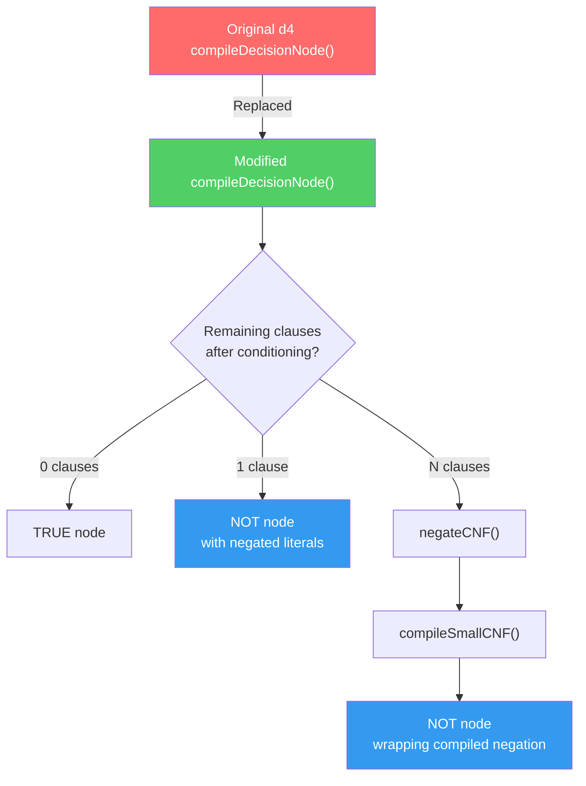

# D4 Dual-Negation: Complete Modification Guide

This document describes **every key modification** made to the original [d4 compiler](https://github.com/crillab/d4) to implement the **dual-negation** (POG — Partitioned Operation Graph) algorithm. Use this as a blueprint to reproduce the implementation from scratch.

---

## Table of Contents

1. [Theoretical Foundation](#1-theoretical-foundation)
2. [Architecture Overview](#2-architecture-overview)
3. [Files Modified/Created](#3-files-modifiedcreated)
4. [Modification 1: New `NotNode` DAG Node](#4-modification-1-new-notnode-dag-node)
5. [Modification 2: CNF Negation Utility](#5-modification-2-cnf-negation-utility)
6. [Modification 3: Compiler — Helper Functions](#6-modification-3-compiler--helper-functions)
7. [Modification 4: Compiler — Decision Node (Core Change)](#7-modification-4-compiler--decision-node-core-change)
8. [Modification 5: Sub-Solver for Negated CNFs](#8-modification-5-sub-solver-for-negated-cnfs)
9. [Modification 6: Statistics & Output](#9-modification-6-statistics--output)
10. [Worked Example](#10-worked-example)
11. [Key Design Decisions](#11-key-design-decisions)
12. [Known Bugs & Fixes](#12-known-bugs--fixes)

---

## 1. Theoretical Foundation

### Original d4 Behavior

In the original d4 compiler, `compileDecisionNode()` works as follows:

```
Pick variable v
├── Positive branch (v = true):  compile_(remaining formula) → pos DAG
├── Negative branch (v = false): compile_(remaining formula) → neg DAG
└── Return OR(pos, neg)
```

Both branches recursively call `compile_()`, which:
1. Runs the SAT solver with assumptions
2. Detects independent components
3. Recurses into each component via `compileDecisionNode()`

### Dual-Negation Strategy

The dual-negation approach replaces the recursive `compile_()` call with a **NOT node** whenever possible:

```
Pick variable v
├── Positive branch (v = true):
│   ├── If all clauses satisfied → TRUE
│   ├── If 1 clause remains → NOT(TRUE, [negated literals])
│   └── If N clauses remain → NOT(compile(negate(remaining)))
├── Negative branch (v = false): (same logic)
└── Return OR(pos, neg)
```

> [!IMPORTANT]
> The key insight: Instead of compiling the **remaining formula** `φ|ₓ`, we compile its **negation** `¬(φ|ₓ)` and wrap it in a NOT node. This produces a POG (Partitioned Operation Graph) that can be more compact than a standard d-DNNF.

### Mathematical Basis

For a remaining CNF `φ = C₁ ∧ C₂ ∧ ... ∧ Cₙ`:

- **Negation**: `¬φ = ¬C₁ ∨ ¬C₂ ∨ ... ∨ ¬Cₙ` (DNF)
- **Single clause** `C = (l₁ ∨ l₂ ∨ ... ∨ lₖ)`: `¬C = (¬l₁) ∧ (¬l₂) ∧ ... ∧ (¬lₖ)` → unit literals
- **Multiple clauses**: Convert DNF back to CNF via distributive law, then compile recursively

---

## 2. Architecture Overview



---

## 3. Files Modified/Created

| File | Status | Purpose |
|------|--------|---------|
| [DAG/NotNode.hh](file:///home/SushrutaXVII/D4/d4-2/d4-dual-negation/DAG/NotNode.hh) | **NEW** | NOT node DAG class |
| [utils/negateCNF.hh](file:///home/SushrutaXVII/D4/d4-2/d4-dual-negation/utils/negateCNF.hh) | **NEW** | CNF negation utility (De Morgan's + distributive law) |
| [compilers/dDnnfCompiler.hh](file:///home/SushrutaXVII/D4/d4-2/d4-dual-negation/compilers/dDnnfCompiler.hh) | **MODIFIED** | Core compilation logic — the biggest change |
| [DAG/DAG.hh](file:///home/SushrutaXVII/D4/d4-2/d4-dual-negation/DAG/DAG.hh) | **MODIFIED** | Added `#include "NotNode.hh"` |
| [core/Main.cc](file:///home/SushrutaXVII/D4/d4-2/d4-dual-negation/core/Main.cc) | **MODIFIED** | Formatting + minor output changes |

---

## 4. Modification 1: New `NotNode` DAG Node

> [!NOTE]
> The original d4 has no NOT node type. This is an entirely **new DAG node class** that must be created.

### File: [DAG/NotNode.hh](file:///home/SushrutaXVII/D4/d4-2/d4-dual-negation/DAG/NotNode.hh) (NEW)

The NOT node represents logical negation of its child subtree. It carries **negated unit literals** directly on its edge.

### Class Structure

```cpp
template <class T> class notNode : public DAG<T> {
public:
  DAG<T> *child;        // Points to child subtree (often globalTrueNode)
  T nbModels;           // Cached model count
  int numFreeVars;      // Number of free variables for complement calculation
  vec<Lit> negLits;     // Negated unit literals carried on the edge
};
```

### Three Constructors

```cpp
// 1. Basic: child only
notNode(DAG<T> *c);

// 2. Child + free variable count (used for multi-clause case)
notNode(DAG<T> *c, int nFreeVars);

// 3. Child + negated literals + free vars (used for single-clause case)
notNode(DAG<T> *c, vec<Lit> &lits, int nFreeVars);
```

### Output Format

The NOT node prints itself in the NNF output as:
```
n <node_id> 0                           // Node declaration (type = 'n' for NOT)
<node_id> <child_id> <lit1> <lit2> ... 0  // Edge with literals
```

Example: For remaining clause `(x₃ ∨ x₄)`, negation is `(¬x₃ ∧ ¬x₄)`:
```
n 4 0        // NOT node #4
4 3 -3 -4 0  // Edge: NOT(#4) → TRUE(#3) with literals -3, -4
```

### Integration into DAG.hh

Add the include to [DAG/DAG.hh](file:///home/SushrutaXVII/D4/d4-2/d4-dual-negation/DAG/DAG.hh):

```diff
 #include "PCNode.hh"
+#include "NotNode.hh"
```

---

## 5. Modification 2: CNF Negation Utility

### File: [utils/negateCNF.hh](file:///home/SushrutaXVII/D4/d4-2/d4-dual-negation/utils/negateCNF.hh) (NEW)

This utility provides functions to negate a CNF formula using De Morgan's laws and convert the resulting DNF back to CNF.

### Key Function: `negateCNF()`

```cpp
void negateCNF(vec<vec<Lit>> &inputCNF, vec<vec<Lit>> &outputCNF);
```

**Algorithm:**

1. **Empty CNF** (true) → Output empty clause (false)
2. **Single clause** `(l₁ ∨ l₂ ∨ ... ∨ lₙ)`:
   - Negation: `(¬l₁) ∧ (¬l₂) ∧ ... ∧ (¬lₙ)` — each becomes a unit clause
3. **Multiple clauses** `C₁ ∧ C₂ ∧ ... ∧ Cₙ`:
   - Step 1: Negate each clause → DNF terms: `¬C₁ ∨ ¬C₂ ∨ ... ∨ ¬Cₙ`
   - Step 2: Convert DNF → CNF via distributive law (cross-product)

**Example:**
```
Input:  (x₃ ∨ x₄) ∧ (x₅ ∨ x₆)
Step 1: ¬C₁ = (¬x₃ ∧ ¬x₄),  ¬C₂ = (¬x₅ ∧ ¬x₆)
Step 2: DNF = (¬x₃ ∧ ¬x₄) ∨ (¬x₅ ∧ ¬x₆)
Step 3: CNF = (¬x₃ ∨ ¬x₅) ∧ (¬x₃ ∨ ¬x₆) ∧ (¬x₄ ∨ ¬x₅) ∧ (¬x₄ ∨ ¬x₆)
```

> [!WARNING]
> The DNF-to-CNF conversion is **exponential** in the number of clauses. For `k` clauses each of size `m`, the output has `m^k` clauses. This is acceptable for small remaining formulas (typical after conditioning), but could blow up for large ones.

> [!CAUTION]
> **Known Bug — HIGH severity (see Section 12):** The cross-product loop does NOT filter **tautological clauses** (e.g., `(¬x₃ ∨ x₃)`). When remaining clauses share a variable with opposite polarity, phantom tautological clauses enter the sub-solver. Their DNF terms produce binding constraints that force incorrect variable assignments, making satisfiable branches evaluate to FALSE. See [Section 12, Bug 1](#bug-1--missing-tautology-filter-in-negatecnf) for the fix.

### Helper Function: `conditionCNF()`

```cpp
void conditionCNF(vec<vec<Lit>> &inputCNF, Lit l, vec<vec<Lit>> &outputCNF);
```

Simplifies a CNF by assigning a literal to true (removes satisfied clauses, removes false literals).

---

## 6. Modification 3: Compiler — Helper Functions

### File: [compilers/dDnnfCompiler.hh](file:///home/SushrutaXVII/D4/d4-2/d4-dual-negation/compilers/dDnnfCompiler.hh)

Several new helper functions were added to support dual-negation:

### 6a. New includes

```diff
 #include "../utils/Solver.hh"
 #include "../utils/SolverTypes.hh"
 #include "../utils/System.hh"
+#include "../utils/negateCNF.hh"
 
+#include "../DAG/NotNode.hh"
```

### 6b. New member variable: `nbNotNode`

```diff
   unsigned int nbAndNode, nbAndMinusNode;
+  unsigned int nbNotNode; // Count of NOT nodes for dual-negation
```

Initialize it in the constructor:

```diff
   nbAndMinusNode = nbAndNode = nbDecisionNode = nbDomainConstraintNode =
       nbNodeInCompile = 0;
+  nbNotNode = 0;
```

### 6c. `countFreeVarsInClauses()`

Counts unique variables in a clause set. Used to track how many free variables the NOT node covers (for complement model counting).

```cpp
int countFreeVarsInClauses(vec<vec<Lit>> &clauseSet) {
    vec<bool> seen;
    seen.initialize(s.nVars(), false);
    int count = 0;
    for (int i = 0; i < clauseSet.size(); i++)
        for (int j = 0; j < clauseSet[i].size(); j++) {
            Var v = var(clauseSet[i][j]);
            if (!seen[v]) { seen[v] = true; count++; }
        }
    return count;
}
```

### 6d. `getConditionedClauses()`

Returns the **remaining unsatisfied clauses** after the solver has assigned variables via assumptions. Filters by connected component.

```cpp
void getConditionedClauses(vec<vec<Lit>> &conditionedClauses, vec<Var> &connected);
```

**Logic:**
1. Build lookup set of variables in the current component
2. For each original clause:
   - Skip if no variable belongs to this component
   - If any literal is true → clause satisfied, skip
   - If literal is false → remove it
   - Otherwise → keep it
3. Collect remaining clauses with unassigned literals

### 6e. `getConditionedClausesFromSolver()`

Same as above, but works with **any Solver instance** (not just the main solver `s`). Used by the sub-solver in `compileSmallCNF_()`.

```cpp
void getConditionedClausesFromSolver(vec<vec<Lit>> &conditioned,
                                     Solver &solver,
                                     vec<vec<Lit>> &originalClauses);
```

---

## 7. Modification 4: Compiler — Decision Node (Core Change)

> [!IMPORTANT]
> This is the **most critical modification** — the heart of the dual-negation algorithm. The original `compileDecisionNode()` is replaced entirely.

### Original d4 `compileDecisionNode()` (before)

```cpp
DAG<T> *compileDecisionNode(vec<Var> &connected, vec<Var> &priorityVar) {
    // ... variable selection ...
    Lit l = mkLit(v, ...);

    // Positive branch: FULL recursive compile
    (s.assumptions).push(l);
    DAG<T> *pos = compile_(connected, priorityVar, l, bPos, fromCachePos, idxReason);
    (s.assumptions).pop();
    (s.cancelUntil)((s.assumptions).size());

    // Negative branch: FULL recursive compile
    (s.assumptions).push(~l);
    DAG<T> *neg = compile_(connected, priorityVar, ~l, bNeg, fromCacheNeg, idxReason);
    (s.assumptions).pop();
    (s.cancelUntil)((s.assumptions).size());

    return createObjectDecisionNode(pos, bPos, ..., neg, bNeg, ...);
}
```

### Modified `compileDecisionNode()` (after)

Each branch now has **three cases** instead of a single `compile_()` call:

```cpp
// === POSITIVE BRANCH ===
(s.assumptions).push(l);

if (!s.solveWithAssumptions()) {
    // UNSAT → use FALSE node, compile negative branch normally
    pos = globalFalseNode;
} else {
    // Get remaining clauses after conditioning
    vec<vec<Lit>> conditionedPos;
    getConditionedClauses(conditionedPos, connected);

    if (conditionedPos.size() == 0) {
        // CASE 1: All clauses satisfied → TRUE directly
        pos = globalTrueNode;

    } else if (conditionedPos.size() == 1) {
        // CASE 2: Single remaining clause → NOT with negated literals
        // e.g., remaining (x₃ ∨ x₄) → NOT(TRUE, [¬x₃, ¬x₄])
        vec<Lit> negatedLits;
        for (int j = 0; j < conditionedPos[0].size(); j++)
            negatedLits.push(~conditionedPos[0][j]);
        pos = new notNode<T>(globalTrueNode, negatedLits, numFreeVars);
        nbNotNode++;

    } else {
        // CASE 3: Multiple remaining → negate CNF, compile, wrap with NOT
        vec<vec<Lit>> negatedCNF;
        negateCNF(conditionedPos, negatedCNF);
        DAG<T> *compiledNeg = compileSmallCNF(negatedCNF);
        pos = new notNode<T>(compiledNeg, numFreeVars);
        nbNotNode++;
    }
}
(s.assumptions).pop();
(s.cancelUntil)((s.assumptions).size());

// === NEGATIVE BRANCH === (identical logic with ~l)
```

### Critical Order-of-Operations Detail

> [!CAUTION]
> In the original code, `collectUnit()` and solver state cleanup happen **outside** the conditional. In the modified version, each case **independently** handles unit collection and solver cleanup. This is because `getConditionedClauses()` must be called **while the solver still has the assumptions active** to correctly determine which clauses are satisfied.

```diff
-    // Original: collect units THEN pop assumptions THEN check clauses
-    getConditionedClauses(conditionedPos, connected);
-    bPos.units.clear();
-    s.collectUnit(connected, bPos.units, l);
-    (s.assumptions).pop();
-    (s.cancelUntil)((s.assumptions).size());

+    // Modified: check clauses WITH assumptions active, handle cleanup per-case
+    getConditionedClauses(conditionedPos, connected);
+    if (conditionedPos.size() == 0) {
+        bPos.units.clear();
+        s.collectUnit(connected, bPos.units, l);
+        (s.assumptions).pop();
+        (s.cancelUntil)((s.assumptions).size());
+        pos = globalTrueNode;
+    } else if (...) {
+        bPos.units.clear();
+        s.collectUnit(connected, bPos.units, l);
+        (s.assumptions).pop();
+        (s.cancelUntil)((s.assumptions).size());
+        // ... create NOT node ...
+    }
```

---

## 8. Modification 5: Sub-Solver for Negated CNFs

When multiple clauses remain (Case 3), we negate the CNF and need to **compile the negated formula**. This is done with a dedicated sub-solver, NOT the main solver.

### `compileSmallCNF()` — Entry Point

```cpp
DAG<T> *compileSmallCNF(vec<vec<Lit>> &cnfClauses);
```

**Steps:**
1. Find all variables and max variable index
2. Create a **new lightweight Solver instance** (independent of main solver `s`)
3. Load clauses into sub-solver
4. Check satisfiability
5. Capture **level-0 unit propagations** (unit clauses that propagate at level 0)
6. Call `compileSmallCNF_()` for recursive compilation
7. If level-0 units exist, wrap result with `UnaryNode` to preserve them

> [!TIP]
> **Why a sub-solver?** The main solver `s` already has the original formula loaded with assumptions. We can't load a different formula into it. A separate lightweight solver avoids interference.

### `compileSmallCNF_()` — Recursive Helper

```cpp
DAG<T> *compileSmallCNF_(Solver &ss, vec<Var> &vars, vec<vec<Lit>> &cnfClauses);
```

This is a lightweight recursive compiler that applies dual-negation **at every level**:

1. Pick an unassigned variable
2. For each branch (positive/negative):
   - Push assumption, solve
   - Get remaining clauses via `getConditionedClausesFromSolver()`
   - If UNSAT → FALSE
   - If 0 remaining → TRUE
   - If 1 remaining → NOT(TRUE, negated literals)
   - If N remaining → negate CNF, recurse via `compileSmallCNF()`, wrap with NOT
3. Only **newly assigned literals** go on edges (no ancestor duplicates)

```cpp
// Track which vars were already assigned before this decision
vec<bool> wasAssigned;
for (int i = 0; i < vars.size(); i++)
    if (ss.value(vars[i]) != l_Undef)
        wasAssigned[vars[i]] = true;

// After decision, collect ONLY new assignments
for (int i = 0; i < vars.size(); i++) {
    if (vars[i] == pickV) continue;
    if (!wasAssigned[vars[i]] && ss.value(vars[i]) != l_Undef)
        bPos.units.push(mkLit(vars[i], ss.value(vars[i]) == l_False));
}
```

---

## 9. Modification 6: Statistics & Output

### Statistics Printing

Added NOT node count to the statistics output:

```diff
  printf("c Number of decomposable AND nodes: %u\n", nbAndNode);
+ printf("c Number of NOT nodes (dual-negation): %u\n", nbNotNode);
  printf("c Number of backbone calls: %u\n", callEquiv);
```

### Model Count Output

In `compileDDNNF()` in [Main.cc](file:///home/SushrutaXVII/D4/d4-2/d4-dual-negation/core/Main.cc), the model count print was commented out (since NOT nodes affect counting):

```diff
- cout << std::fixed << "s " << t1 << endl;
+ // cout << std::fixed << "s " << t1 << endl;
```

> [!CAUTION]
> **Known Bug (see Section 12):** `computeNbModels()` in `NotNode.hh` is a **pass-through** — it returns the child's count directly instead of computing the complement `2^n - count(child)`. Model counting via the d-DNNF graph is **broken**. The `-mc` flag uses a separate `ModelCounter` class and is unaffected. See [Section 12, Bug 2](#bug-2--model-counting-is-broken) for the fix.

---

## 10. Worked Example

### Input: `littleTest.cnf`
```
p cnf 4 2
1 2 0       ← C₁: (x₁ ∨ x₂)
-1 3 4 0    ← C₂: (¬x₁ ∨ x₃ ∨ x₄)
```

### Compilation Trace

```
Decision: x₁

├── Positive branch (x₁ = true):
│   C₁ = (x₁ ∨ x₂) → SATISFIED (x₁ is true)
│   C₂ = (¬x₁ ∨ x₃ ∨ x₄) → remaining: (x₃ ∨ x₄)
│   → 1 clause remaining → CASE 2
│   → NOT(TRUE, [¬x₃, ¬x₄])
│   Edge literals: [x₁]
│
├── Negative branch (x₁ = false):
│   C₁ = (x₁ ∨ x₂) → remaining: (x₂), then x₂ propagated as unit
│   C₂ = (¬x₁ ∨ x₃ ∨ x₄) → SATISFIED (¬x₁ is true)
│   → 0 clauses remaining → CASE 1
│   → TRUE
│   Edge literals: [¬x₁, x₂]
│
└── OR(pos, neg)
```

### Output NNF

```
o 1 0         ← OR node 1 (root's child)
o 2 0         ← OR node 2 (decision node)
t 3 0         ← TRUE node (shared)
n 4 0         ← NOT node
4 3 -3 -4 0   ← NOT(#4) → TRUE(#3) with literals ¬x₃, ¬x₄
2 3 -1 2 0    ← OR(#2) → TRUE(#3) via edge [¬x₁, x₂]  (neg branch)
2 4 1 0       ← OR(#2) → NOT(#4) via edge [x₁]         (pos branch)
1 2 0         ← OR(#1) → OR(#2)
s 2           ← root points to node 2
```

### Visual DAG

```
         ROOT
          │
         OR(2)
        /     \
  [x₁=T]      [x₁=F, x₂=T]
      |              |
    NOT(4)        TRUE(3)
      |
  [¬x₃, ¬x₄]
      |
    TRUE(3)
```

---

## 11. Key Design Decisions

### Why NOT always use `compile_()` for remaining clauses?

The NOT node approach avoids the full `compile_()` overhead (SAT solving, caching, component detection) for simple cases. When only 1 clause remains, the negation is trivial and doesn't need recursive compilation.

### Why a sub-solver instead of the main solver?

The main solver has the **original formula** loaded and is mid-search with assumptions. The negated CNF is a **different formula** entirely. Loading it into the main solver would corrupt the search state.

### Why track `wasAssigned` in `compileSmallCNF_()`?

To prevent **redundant edge literals**. Without this, a propagated literal from an ancestor decision would appear on every descendant edge. The `wasAssigned` check ensures only **newly propagated** literals appear on each edge.

### What about the exponential blowup in `negateCNF()`?

For the typical case where only 1-2 clauses remain after conditioning, the blowup is negligible. For larger remaining formulas, the cross-product could be expensive, but this is rare in practice since the main solver's unit propagation usually reduces the formula significantly.

---

## Summary of Changes

| What Changed | Original d4 | d4-dual-negation |
|---|---|---|
| **Decision node branches** | Always calls `compile_()` recursively | Three cases: TRUE / NOT(literals) / NOT(compile(negate)) |
| **NOT node** | Does not exist | New DAG node type with negated literals on edge |
| **CNF negation** | Does not exist | `negateCNF()` utility using De Morgan + distributive law |
| **Sub-solver** | Not needed | Dedicated sub-solver for compiling negated CNFs |
| **Edge literals** | May include ancestor literals | Only newly-assigned literals |
| **Output format** | `o` (OR), `t` (TRUE), `f` (FALSE) | Adds `n` (NOT) node type |
| **Model counting** | Works directly | Requires complement computation (**broken — see Section 12**) |

---

## 12. Known Bugs & Fixes

Three bugs were identified through code-level analysis and verified against the implementation.

---

### Bug 1 — Missing Tautology Filter in `negateCNF`

**Severity:** HIGH (produces semantically incorrect results)

**Location:** [utils/negateCNF.hh:122-136](file:///home/SushrutaXVII/D4/d4-2/d4-dual-negation/utils/negateCNF.hh#L122-L136)

**Problem:** The cross-product loop blindly appends literals without checking for complementary pairs (`l` and `¬l` in the same clause). When remaining clauses share a variable with opposite polarity, tautological clauses like `(¬x₃ ∨ x₃)` are generated.

**Example:** Remaining `{(x₃ ∨ x₄), (¬x₃ ∨ x₅)}` produces:
```
Cross-product: (¬x₃ ∨ x₃)  ← TAUTOLOGY
               (¬x₃ ∨ ¬x₅) ← valid
               (¬x₄ ∨ x₃)  ← valid  
               (¬x₄ ∨ ¬x₅) ← valid
```

**Impact:** MiniSat silently discards tautologies in `addClause_()`, but `getConditionedClausesFromSolver()` checks the raw `cnfClauses` vector — so phantom tautological clauses appear as "active remaining" clauses. When these phantom clauses enter the next `negateCNF` call, the tautological clause's DNF term (e.g., `{x₃, ¬x₃, ...}`) is split into **individual literals** that combine with other terms to produce **non-tautological, binding constraints**. These phantom constraints force variable assignments in the sub-solver that don't exist in the original formula, making satisfiable branches evaluate to FALSE.

> [!CAUTION]
> This is NOT self-correcting. A tautological clause's DNF term contains both `l` and `¬l`. In the cross-product, each is paired individually with other terms, producing real clauses like `(x₃, x₅)` and `(¬x₃, x₅)` whose conjunction forces `x₅=T`. These phantom constraints corrupt the sub-solver's result.

**Fix:** Add tautology and duplicate checks in the cross-product inner loop:

```diff
  for(size_t l = 0; l < dnfTerms[t].size(); l++)
  {
-   std::vector<Lit> newClause = partialClauses[p];
-   newClause.push_back(dnfTerms[t][l]);
-   newPartials.push_back(newClause);
+   Lit newLit = dnfTerms[t][l];
+   bool isTautology = false;
+   bool isDuplicate = false;
+   for(size_t k = 0; k < partialClauses[p].size(); k++) {
+     if (partialClauses[p][k] == ~newLit) { isTautology = true; break; }
+     if (partialClauses[p][k] == newLit)  { isDuplicate = true; break; }
+   }
+   if (isTautology) continue;  // skip tautological clause entirely
+   std::vector<Lit> newClause = partialClauses[p];
+   if (!isDuplicate) newClause.push_back(newLit);
+   newPartials.push_back(newClause);
  }
```

---

### Bug 2 — Model Counting is Broken

**Severity:** HIGH (produces wrong model counts from d-DNNF graph)

**Location:** [DAG/NotNode.hh:103-114](file:///home/SushrutaXVII/D4/d4-2/d4-dual-negation/DAG/NotNode.hh#L103-L114)

**Problem:** `computeNbModels()` is a **pass-through** — it returns the child's model count directly instead of computing the complement:

```cpp
// CURRENT (broken): just returns child count
if (child)
    nbModels = child->computeNbModels();
```

**Fix:** Implement complement formula `2^numFreeVars - count(child)`:

```cpp
inline T computeNbModels() {
    if (stamp == globalStamp) return nbModels;
    stamp = globalStamp;

    if (child) {
        T childModels = child->computeNbModels();
        T totalModels = T(1) << numFreeVars;  // 2^n
        nbModels = totalModels - childModels;  // complement
    } else
        nbModels = 0;
    return nbModels;
}
```

**Mitigation:** The `-mc` flag uses a separate `ModelCounter` class (not the d-DNNF path) and produces correct results. The d-DNNF model count print is disabled (`// cout << "s " << t1`).

---

### Bug 3 — Missing Decision Literal on UNSAT Branch Edges

**Severity:** MEDIUM (structurally incorrect NNF output)

**Location:** [compilers/dDnnfCompiler.hh:715-716](file:///home/SushrutaXVII/D4/d4-2/d4-dual-negation/compilers/dDnnfCompiler.hh#L715-L716) (positive UNSAT) and [line 778-779](file:///home/SushrutaXVII/D4/d4-2/d4-dual-negation/compilers/dDnnfCompiler.hh#L778-L779) (negative UNSAT)

**Problem:** When a branch is UNSAT, `bPos.units` is cleared but the decision literal `l` is **never pushed**. In the original d4, `compile_()` → `manageUnsat(l, onB)` pushes `l` onto `onB.units`. The modified code skips `compile_()` entirely.

**Comparison:** The sub-solver (`compileSmallCNF_`) handles this correctly — it pushes `pickL` on UNSAT.

```cpp
// compileSmallCNF_ (correct):
if (!ss.solveWithAssumptions()) {
    pos = globalFalseNode;
    bPos.units.push(pickL);    // ✓ decision literal pushed
}

// compileDecisionNode (broken):
if (!s.solveWithAssumptions()) {
    bPos.units.clear();        // ✗ decision literal l never pushed
    bPos.free.clear();
}
```

**Fix:** Push the decision literal onto the UNSAT branch units:

```diff
  // Positive UNSAT (line ~715)
  bPos.units.clear();
+ bPos.units.push(l);     // decision literal must be on the edge
  bPos.free.clear();

  // Negative UNSAT (line ~778)
  bNeg.units.clear();
+ bNeg.units.push(~l);    // decision literal must be on the edge
  bNeg.free.clear();
```

---

### Bug Summary

| Bug | Severity | Impact | Fix Size |
|-----|----------|--------|----------|
| Tautology filter | **High** | Phantom constraints make SAT branches → FALSE | ~8 lines |
| Model counting | High | Wrong d-DNNF model counts (mitigated: output disabled) | ~5 lines |
| UNSAT edge literal | Medium | Structurally incorrect NNF edges | 2 lines |

---

### Missing Issue 1 — `compileNegatedCNF` Dead Code with Wrong Fallback

**Severity:** LOW (dead code — never called)

**Location:** [compilers/dDnnfCompiler.hh:275-326](file:///home/SushrutaXVII/D4/d4-2/d4-dual-negation/compilers/dDnnfCompiler.hh#L275-L326)

**Problem:** The function `compileNegatedCNF()` is defined but **never called** — the main flow uses `negateCNF()` + `compileSmallCNF()` instead. However, its fallback at line 324-325 is semantically wrong:

```cpp
// For more complex negated CNFs (multiple non-unit clauses),
// fall back to returning TRUE (simplified for small CNFs)
return globalTrueNode;  // ← WRONG: returns TRUE for a non-trivial formula
```

This would silently return TRUE for any negated CNF with non-unit clauses, producing incorrect results. Since no code path calls this function, it has no runtime impact, but it should be removed to avoid confusion.

---

### Missing Issue 2 — UNSAT Positive Branch Falls Back to `compile_()`

**Severity:** LOW (structural inconsistency, not a correctness bug)

**Location:** [compilers/dDnnfCompiler.hh:704-718](file:///home/SushrutaXVII/D4/d4-2/d4-dual-negation/compilers/dDnnfCompiler.hh#L704-L718)

**Problem:** When the positive branch is UNSAT, the negative branch is compiled with `compile_()` (original d4 recursive path) instead of the dual-negation path:

```cpp
if (!s.solveWithAssumptions()) {
    // ...
    (s.assumptions).push(~l);
    DAG<T> *negCompiled =
        compile_(connected, priorityVar, ~l, bNeg, fromCacheNeg, idxReason);
    // ...
}
```

This creates a **structurally inconsistent DAG** — some OR nodes have NOT children (dual-negation), while others have standard d4 subtrees (recursive `compile_()`). The result is semantically correct (both paths produce valid d-DNNF), but the output mixes two different compilation strategies.
